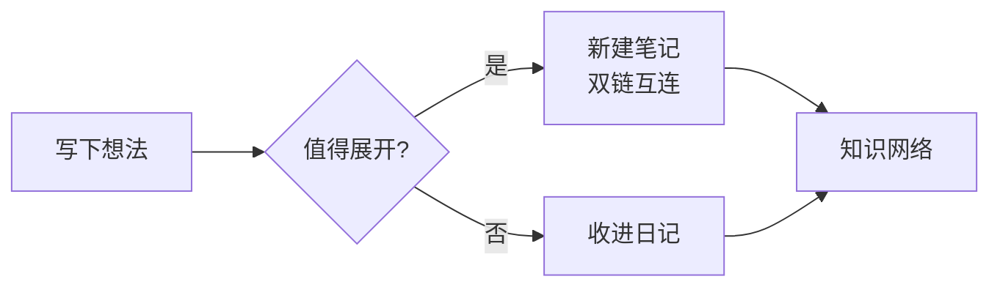
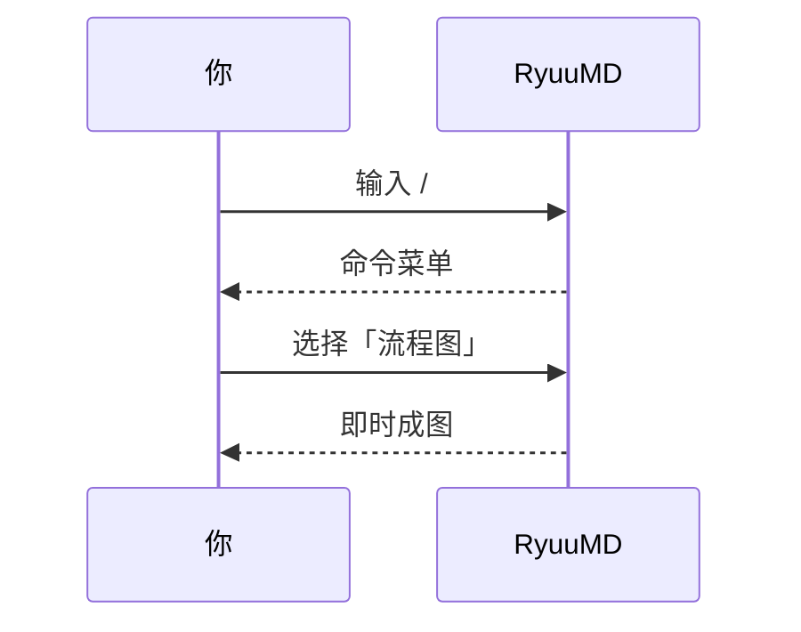
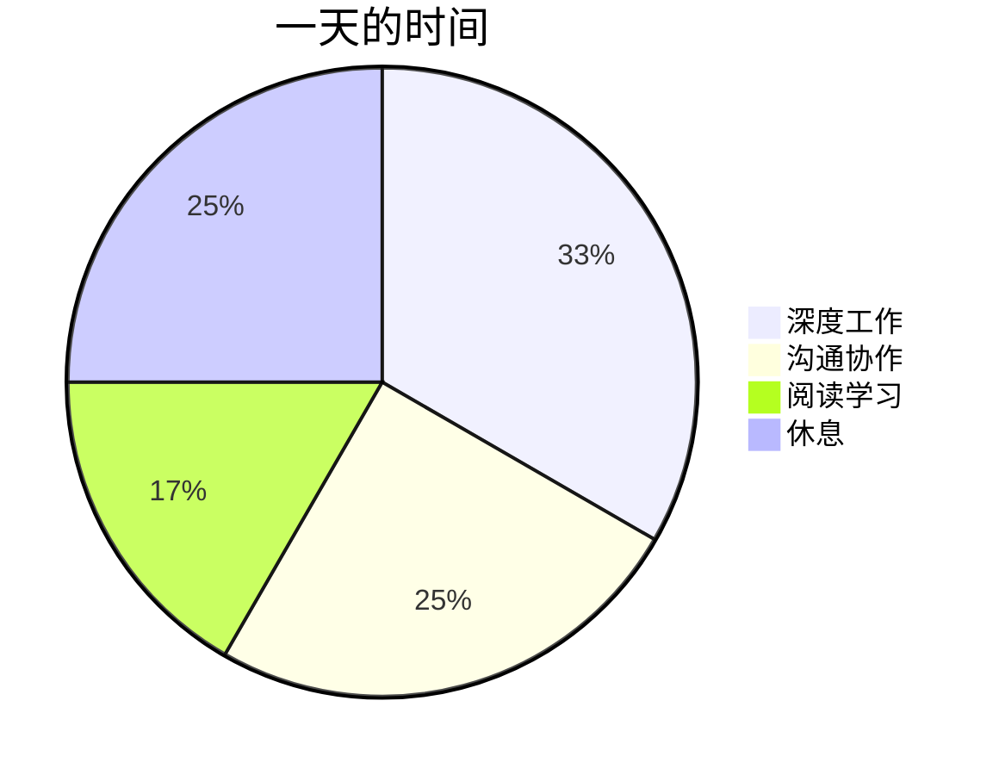

# 03 图表与公式

RyuuMD 内置 **mermaid 图表**与 **LaTeX 公式**的即时渲染，无需联网、无需插件。

## Mermaid 图表

在代码块上写 ` ```mermaid ` 即可成图。斜杠菜单「图表」组有一键模板：

| 触发词 | 图表 |
| --- | --- |
| `/lct` | 流程图 |
| `/sxt` | 时序图 |
| `/gtt` | 甘特图 |
| `/lt` `/ztt` | 类图、状态图 |
| `/bt` `/ert` | 饼图、ER 图 |
| `/swdt` `/sjx` `/yhlct` | 思维导图、时间线、用户旅程图 |

下面三张图是真实渲染结果（切到源码模式可看语法）：







> [!tip] 切换亮 / 暗主题时，mermaid 图会自动按新主题重渲染。

## 数学公式

行内公式用 `$…$`：质能方程 $E=mc^2$，以及求和 $\sum_{i=1}^{n} i = \frac{n(n+1)}{2}$。

公式块用 `$$…$$`（斜杠命令 `/gsk`）：

$$
\int_{-\infty}^{+\infty} e^{-x^2} \, dx = \sqrt{\pi}
$$

$$
x = \frac{-b \pm \sqrt{b^2-4ac}}{2a}
$$

### 公式引擎

设置 → 通用 →「公式引擎」：

- **KaTeX**（默认）：渲染更快；
- **MathJax**：兼容更多 LaTeX 宏与语法。

切换后编辑器自动重建，公式立即按新引擎渲染。

> 试试看：输入 `/gsk` 插入一个公式块，写下 `\frac{a}{b}` 看看效果。

---

上一篇：[[02 排版与斜杠命令]] ｜ 下一篇：[[04 双链与知识管理]]
