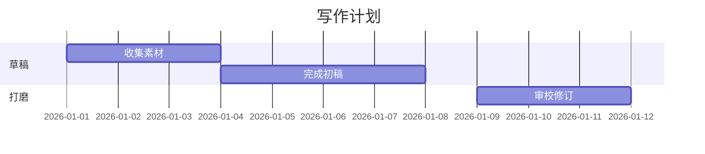
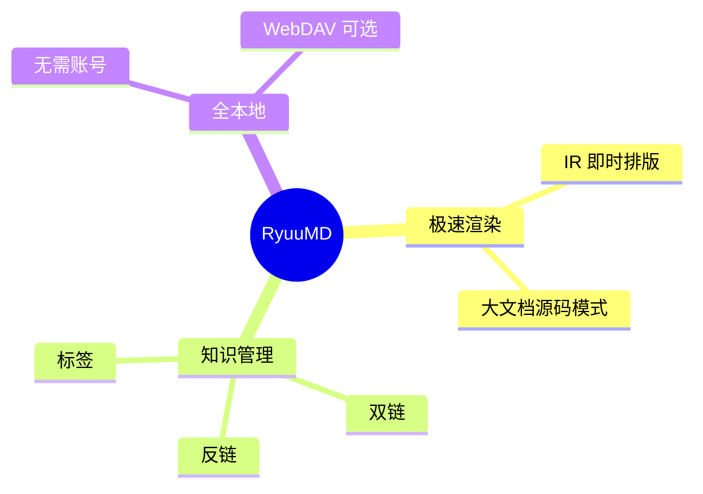

# example · RyuuMD 全功能一览

> [!note] 本页是什么？
> 一页看遍 RyuuMD 的全部渲染能力。切到右下角「源码」模式可对照学习语法。
> 回到 [[欢迎使用 RyuuMD]] 查看分章教程。

[toc]

---

## 标题层级

# 一级标题
## 二级标题
### 三级标题
#### 四级标题
##### 五级标题
###### 六级标题

## 文字格式

**加粗**、*斜体*、~~删除线~~、==高亮==、`行内代码`，以及它们的组合：**加粗里的 `代码` 与 [[双链]]**。

## 引用与提示块

> 普通引用块。
> 可以多行，
>
> > 也可以嵌套。

> [!note] 提示
> 用 `/tip` 插入提示块，适合补充说明。

> [!warning] 注意
> 同一语法的警示样式。

## 列表

无序列表：

- 苹果
- 香蕉
  - 海南蕉
  - 小米蕉
- 橙子

有序列表：

1. 打开 RyuuMD
2. 新建文档
3. 开始写作

待办列表（点击方框可勾选）：

- [x] 安装 RyuuMD
- [x] 打开学习仓库
- [ ] 写下第一篇笔记

## 表格

| 功能 | 快捷键 | 说明 |
| :--- | :---: | ---: |
| 保存 | `Ctrl+S` | 左对齐 |
| 快速打开 | `Ctrl+P` | 居中 |
| 命令面板 | `Ctrl+Shift+P` | 右对齐 |

> 表格内右键：插入/删除行列。`/table` 一键插入。

## 代码块

```python
def fib(n):
    """斐波那契数列（带语法高亮）"""
    a, b = 0, 1
    for _ in range(n):
        yield a
        a, b = b, a + b
```

```javascript
// 代码块内右键可复制全部代码
const greet = (name) => `你好，${name}`;
console.log(greet("RyuuMD"));
```

## 数学公式

行内公式：欧拉公式 $e^{i\pi}+1=0$ 被誉为最美公式；还有 $\lim_{x\to 0}\frac{\sin x}{x}=1$。

公式块：

$$
\frac{\partial}{\partial t} \Psi = \frac{i\hbar}{2m} \nabla^2 \Psi
$$

$$
\begin{aligned}
a &= b + c \\
  &= d + e + f
\end{aligned}
$$

> 公式引擎（KaTeX / MathJax）在 设置 → 通用 切换。

## 图表（mermaid）

```mermaid
flowchart TD
    A[💡 想法] --> B{记下来?}
    B -->|随手记| C[收集箱]
    B -->|成体系| D[新建笔记]
    D --> E[[[双链]] 互连]
    C --> E
    E --> F[知识网络生长]
```





## 脚注

Markdown 是轻量化标记语言[^1]，双链笔记法源自卡片盒笔记法[^2]。

[^1]: 由 John Gruber 于 2004 年创造。
[^2]: 即 Zettelkasten，社会学家卢曼的知识管理方法。

## 链接与双链

- 外部链接：[Markdown 官方语法](https://daringfireball.net/projects/markdown/)（系统浏览器打开）；
- 站内双链：[[01 快速上手]]、[[03 图表与公式]]；
- 键入 `[[` 可唤起笔记列表过滤插入。

## 分割线

上面这条由 `---` 或 `/hr` 生成。

## 内容目录

页首的 `[toc]` 会根据标题自动生成目录（长文档必备）。

---

*看完了？回到 [[欢迎使用 RyuuMD]] 继续学习路径，或直接把本页当你的语法速查表。*
